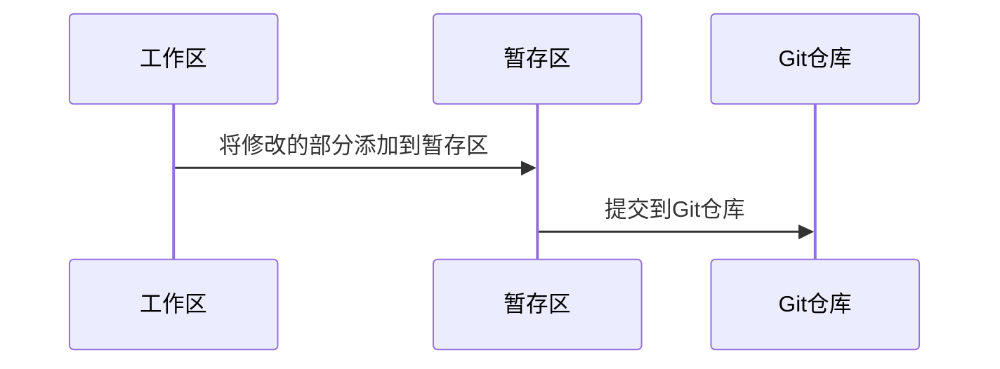

## Git 简介

分布式版本控制系统 

三个状态：

- 已修改(新增/已删除)
- 已暂存
- 已提交

三个区域：

- 工作区
- 暂存区
- Git仓库




## Git 本地使用

- 安装git

- 设置用户信息

  ```git
  git config --global user.name "guopop"
  git config --global user.email "guopop1994@163.com"
  ```

- 初始化本地目录

  ```
  git init
  ```

- 克隆远程仓库

  ```git
  git clone http://39.105.47.81:8880/root/gitdemo.git
  ```

  - 重命名仓库 

    ```
    git clone http://39.105.47.81:8880/root/gitdemo.git mygitdemo 
    ```

- git文件流

  

- 检查当前文件状态

  ```
  git status
  ```

  - 状态简览

    ```
    git status -s
    ```

- 跟踪新文件，添加到暂存区，精确地将内容添加到下一次提交中

  ```
  git add hello.md
  ```

- 丢弃暂存区的修改内容

  ```
  git restore --staged hello.md
  ```

- 丢弃工作区的修改内容

  ```
  git checkout -- hello.md
  ```

- 从暂存区移除文件，使其成为未跟踪文件

  ```
  git rm --cached hello.md
  ```

- 提交更新，添加到Git仓库

  ```
  git commit -m 'init hello.md'
  ```

- 跳过使用暂存区，文件必须全部为跟踪状态

  ```
  git commit -a -m 'add and commit msg'
  ```

- 修改文件名

  ```
  git mv hello.md newHello.md
  ```

- 查看提交历史

  ```
  git log
  ```

  - 一行显示提交历史

    ```
    git log --pretty=oneline
    ```

- 重新提交

  - 将暂存区文件提交到上次的提交的信息中

    ```
    git commit --amend hello.md
    ```
    

- Git仓库版本强制回退

  ```
  git reset --hard cd3b77080d01126d143b60547834b0afee96cfb7
  ```

- Git仓库版本回退撤回

  - 查看引用日志对应撤回版本号

    ```
    git reflog hello.md
    ```

  - Git仓库版本回退撤回版本

    ```
    git reset --hard cd3b770
    ```


## Git 远程仓库

- 查看远程仓库

  ```
  git remote
  ```

  - 显示对应url

    ```
    git remote -v 
    ```

- 从远程仓库抓取或拉取

  - 将所有分支数据下载到本地仓库，不会自动合并和修改工作区

    ```
    git fetch origin
    ```

  - 抓取数据到当前分支

    ```
    git pull
    ```

- 推送到远程仓库

  ```
  git push origin master
  ```

- 远程仓库代码回退，本地仓库先回退到指定版本，强制提交到远程仓库
  ```
  git push -f 
  ```


## Git 分支

Git 分支本质上仅仅是指向提交对象的可变指针

- 查看本地当前所有分支

  ```
  git branch
  ```

- 创建分支

  ```
  git branch test
  ```

- 查看HEAD指针所在分支

  ```
  git log --oneline --decorate
  ```

- 切换分支

  ```
  git checkout test
  ```

- 创建新分支并切换过去

  ```
  git checkout -b dev
  ```

- 合并分支到当前分支，合并的代码为commit后的代码

  ```
  git merge dev
  ```

- 当合并分支时有冲突

  ```
  vim hello.md #编辑冲突文件
  git add hello.md 
  git commit -m 'merge modify'
  ```

- 删除分支

  ```
  git branch -d dev
  ```

## Git + IDEA 使用

- 代码提交
- 切换分支
- 冲突解决
- code review

## 一些使用经验

- 常用分支 master、test、dev
- 生产环境bug  xxx_fix
- 功能分支合并到master, 及时合并到每个分支
- 多人开发


